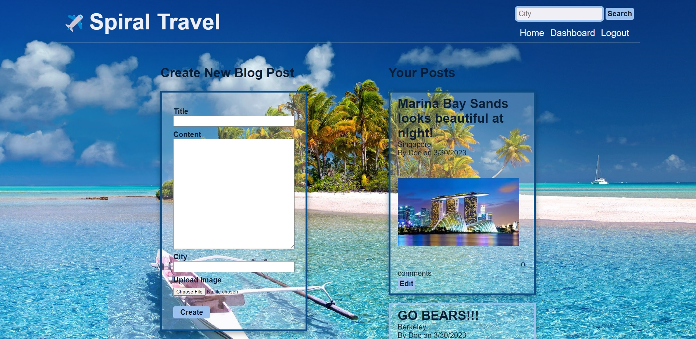

# Spiral Travel

## Description

Are you feeling restless and ready for an adventure but not sure where to begin? One of the most effective ways to uncover new and exciting travel destinations is to gather insights from other globetrotters.

Using Spiral Travel, our easy-to-use traveler app, you can share your own travel stories and peruse those of others. Discover insider knowledge on the best beaches in Bali, the most delicious street food in Tokyo, or the most awe-inspiring hikes in Banff, all while sharing your own unforgettable travel experiences with fellow wanderlusters.

Looking for information on a specific city? Just enter the name of your desired destination and access an array of blog posts and photos to fuel your curiosity before embarking on your next adventure.

Whether you're jet-setting around the world or hitting the open road, it's time to take a break from the daily grind and embrace the freedom of travel with Spiral Travel!

## User Story

• AS A frequent traveler or someone who is planning for a trip,

• I WANT to be able to access a travel blog which contains community-sourced information about different cities around the world,

• SO THAT I can learn about potential travel destinations to help inform my vacation planning.

## Acceptance Criteria

• Upon navigating to the site, the homepage presents a list of existing blog posts and a navigation header with links.

• Clicking on any other links in the navigation prompts you to either log in or sign up.

• To sign up, you must create a username and password, and upon clicking the sign-up button, your user credentials are saved, and you are logged in.

• When you revisit the site and sign in, you see navigation links for the homepage, dashboard, and an option to log out.

• Clicking on an existing blog post displays the post title, content, city, post creator’s username, and date created, and you have the option to leave a comment.

• Submitting a comment while signed in saves the comment and updates the post to display the comment, the comment creator’s username, and the date created.

• Clicking on the dashboard option in the navigation takes you to the dashboard, where you can view your existing blog posts and add new ones.

• To add a new blog post, you must enter values into the title, content and city fields for your post, and if you would like, you can upload an image file as well.

• Clicking on one of your existing posts in the dashboard lets you delete or update your post.

• Searching for a city using the search bar in the header presents blog posts and photos of the city.

• Clicking on the logout option in the navigation signs you out of the site.

## Usage

As a user of the Spiral Travel application, you can explore exciting travel destinations, share your travel experiences, and engage with fellow travel enthusiasts.

When you first arrive at the Spiral Travel homepage, you will be presented with a list of existing blog posts and a navigation header with links to other parts of the site. To fully engage with the site, you will need to log in or sign up for the blog.

If you are a new user, click on the "sign up" link in the navigation header, and you will be prompted to create a username and password. Once you have created your credentials and clicked on the sign-up button, you will be automatically logged in to the site.

As a user of the Spiral Travel application, you have the ability to write your own blog posts about the destinations you have traveled to, sharing your experiences with fellow travel enthusiasts. To create a new post, click on the "dashboard" link in the navigation header, and you will be taken to your personal dashboard, where you can view your existing blog posts and add new ones.

To add a new post, enter values into the title, content and city fields for your blog post. You can also upload a photo. Once you have completed your post, click on the "create" button to save it, and it will be added to the list of existing blog posts on the homepage.

If you are interested in exploring a specific city, you can use the search bar in the navigation header to search for relevant blog posts and photos. Simply enter the name of the city you are interested in, and the site will present you with related content from other users.

In summary, Spiral Travel offers users the opportunity to share their travel experiences and explore new destinations. By signing up and creating your own blog posts, you can contribute to the community of travel enthusiasts and gain valuable insights for your next adventure.

## Screenshots

## Demo

[Spiral Travel](https://watch.screencastify.com/v/aDOJhupa6iPPl7Lhj8BK)

## Links

• Deployed Application URL: https://spiraltravel.herokuapp.com/

• Repository URL: https://github.com/siddz415/project-2

## Credits

• Sam Cott (https://github.com/samc995)

• Sidd Dravid (https://github.com/siddz415)

• Xavier Teo (https://github.com/XvrTeo)

## Technology Used

• CSS and JavaScript

• Node.js

• Express.js, Express-Session, Express-Handlebars, and Express-fileupload

• MySQL

• Sequelize

• Bcrypt

• Pexels API

• Heroku

## License

MIT License

Copyright (c) [2023] [MVC MVPs]

Permission is hereby granted, free of charge, to any person obtaining a copy
of this software and associated documentation files (the "Software"), to deal
in the Software without restriction, including without limitation the rights
to use, copy, modify, merge, publish, distribute, sublicense, and/or sell
copies of the Software, and to permit persons to whom the Software is
furnished to do so, subject to the following conditions:

The above copyright notice and this permission notice shall be included in all
copies or substantial portions of the Software.

THE SOFTWARE IS PROVIDED "AS IS", WITHOUT WARRANTY OF ANY KIND, EXPRESS OR
IMPLIED, INCLUDING BUT NOT LIMITED TO THE WARRANTIES OF MERCHANTABILITY,
FITNESS FOR A PARTICULAR PURPOSE AND NONINFRINGEMENT. IN NO EVENT SHALL THE
AUTHORS OR COPYRIGHT HOLDERS BE LIABLE FOR ANY CLAIM, DAMAGES OR OTHER
LIABILITY, WHETHER IN AN ACTION OF CONTRACT, TORT OR OTHERWISE, ARISING FROM,
OUT OF OR IN CONNECTION WITH THE SOFTWARE OR THE USE OR OTHER DEALINGS IN THE
SOFTWARE.
